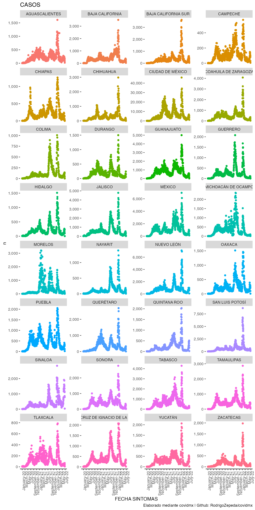

# covidmx 

<!-- badges: start -->
[](https://www.repostatus.org/#active)
[](https://github.com/RodrigoZepeda/covidmx/actions/workflows/R-CMD-check.yaml)
[](https://app.codecov.io/gh/RodrigoZepeda/covidmx?branch=main)
[](https://CRAN.R-project.org/package=covidmx)
<!-- badges: end -->

> :computer: Sitio web: [https://rodrigozepeda.github.io/covidmx/](https://rodrigozepeda.github.io/covidmx/)
  
Descarga, etiqueta y analiza los datos abiertos de COVID-19 en México. El propósito de este paquete es hacer la descarga, análisis y graficación de manera rápida para que tú no tengas que preocuparte por bajar el archivo a tiempo, agrupar funciones o realizar visualizaciones sino en lo importante: analizar la información. 

# Instalación

```{r}
remotes::install_github("RodrigoZepeda/covidmx")
```

# Uso 

Puedes descargar la información de variantes de [GISAID](www.gisaid.org) de la [publicación de Github](https://github.com/RodrigoZepeda/VariantesCovid), ocupación hospitalaria de [RED IRAG](https://www.gits.igg.unam.mx/red-irag-dashboard/reviewHome) a partir del [Github](https://github.com/RodrigoZepeda/CapacidadHospitalariaMX) y datos abiertos de la [SSA](https://datos.gob.mx/busca/dataset/informacion-referente-a-casos-covid-19-en-mexico) todo con los siguientes comandos.

> El proceso está optimizado mediante `duckdb` para que puedas realizar `queries` sobre la base de > 15 millones de personas en segundos. 

```{r}
library(covidmx)

#Datos de variantes (cdmx o nacional)
variantes   <- descarga_datos_variantes_GISAID("nacional")

#Todas las descargas del paquete son inteligentes y si ha pasado poco tiempo desde tu
#última descarga te pregunta primero antes de comprometerse a descargar de nuevo
descarga_datos_variantes_GISAID("nacional") #desactiva con force_download = TRUE

#Datos de ocupación hopsitalaria de Red IRAG ('Estatal' o 'Unidad Médica')
ocupacion   <- descarga_datos_red_irag("Estatal")

#Descarga datos abiertos de covid, guarda en duckdb y te da una conexión
datos_covid <- descarga_datos_abiertos() 

#Calcula los casos (totales) por entidad y devuelve un tibble
datos_covid <- datos_covid %>% casos()

#Calcula la cantidad de pruebas realizadas
datos_covid <- datos_covid %>% numero_pruebas()

#Calcula la positividad
datos_covid <- datos_covid %>% positividad()

#Calcula el case fatality rate
datos_covid <- datos_covid %>% cfr()

#Calcula el case hospitalization rate
datos_covid <- datos_covid %>% chr()

#Estimación del número efectivo de reproducción
datos_covid <- datos_covid %>% estima_rt()

#¡Grafica!
datos_covid %>% plot_covid()
```



> **Nota** No olvides citar a GISAID, RED IRAG o SSA y las publicaciones asociadas además del paquete.

## Casos (opciones de lectura de datos abiertos)

Todas las opciones de **casos**:

```{r}
datos_covid %>% 
  casos(
    #Lista de entidades que deseas
    entidades = c("AGUASCALIENTES", "BAJA CALIFORNIA", 
                  "BAJA CALIFORNIA SUR","CAMPECHE", "CHIAPAS", 
                  "CHIHUAHUA","CIUDAD DE M\u00c9XICO",
                  "COAHUILA DE ZARAGOZA" , "COLIMA", "DURANGO", 
                  "GUANAJUATO", "GUERRERO","HIDALGO", "JALISCO", 
                  "M\u00c9XICO", "MICHOAC\u00c1N DE OCAMPO", 
                  "MORELOS","NAYARIT", "NUEVO LE\u00d3N", "OAXACA", 
                  "PUEBLA", "QUER\u00c9TARO", "QUINTANA ROO", 
                  "SAN LUIS POTOS\u00cd", "SINALOA", "SONORA",
                  "TABASCO", "TAMAULIPAS", "TLAXCALA", 
                  "VERACRUZ DE IGNACIO DE LA LLAVE", 
                  "YUCAT\u00c1N", "ZACATECAS"),
    
    #Si quieres que los resultados salgan por entidad = TRUE o ya agregados = FALSE
    group_by_entidad    = TRUE,
    
    #Selecciona esas entidades a qué tipo de entidad refieren: Unidad Médica, 
    #Residencia o Nacimiento
    entidad_tipo        = "Residencia", 
    
    #Selecciona la fecha para la base de datos: Síntomas, Ingreso, Defunción
    fecha_tipo          = "Ingreso",
     
    #Selecciona todas las variables de clasificación que deseas agregar:
    tipo_clasificacion  = c("Sospechosos","Confirmados COVID", 
                            "Negativo a COVID", "Inválido", 
                            "No realizado"),
    
    #Selecciona si deseas agrupar por la variable tipo_clasificacion
    group_by_tipo_clasificacion = TRUE,
    
    #Selecciona todos los pacientes quieres incluir:
    tipo_paciente      = c("AMBULATORIO", "HOSPITALIZADO", 
                           "NO ESPECIFICADO"),
    
    #Selecciona si agrupar por tipo de paciente
    group_by_tipo_paciente = TRUE,
    
    #Selecciona todas las opciones de Unidad de Cuidado Intensivo
    #del paciente:
    tipo_uci           = c("SI","NO","NO APLICA","SE IGNORA",
                           "NO ESPECIFICADO"),
    
    #Selecciona si agrupar por tipo de unidad
    group_by_tipo_uci  = TRUE,
    
    #Selecciona los sectores del sistema de salud a incluir
    tipo_sector   = c("CRUZ ROJA", "DIF", "ESTATAL", "IMSS", 
                      "IMSS-BIENESTAR", "ISSSTE", 
                      "MUNICIPAL", "PEMEX", "PRIVADA", 
                      "SEDENA", "SEMAR", "SSA", 
                      "UNIVERSITARIO","NO ESPECIFICADO"),
    
    #Selecciona si deseas agrupar por tipo de sector
    group_by_tipo_sector = FALSE,
    
    #Selecciona si deseas sólo los que tuvieron defunción
    defunciones   = TRUE,
    
    #Selecciona los grupos de edad que deseas incluir en rango
    edad_cut      = c(20, 40, 60), #Edades 20-40 y 40-60
    
    #Selecciona si devolver el objeto como tibble
    as_tibble     = TRUE,
    
    #Selecciona si rellenar los conteos (n) con ceros 
    #cuando no haya observaciones.
    fill_zeros    = TRUE,
    
    #Nombre para llamarle en el objeto lista que regresa
    list_name     = "Ejemplo defunciones",
    
    #Otras variables para agrupar no incluidas
    .grouping_vars = c("DIABETES", "SEXO"))
    
#> # A tibble: 
#>    FECHA_INGRESO DIABETES  SEXO EDAD_CAT ENTIDAD_RES CLASIFICACION_FINAL
#>    <date>           <dbl> <dbl> <chr>    <chr>                     <dbl>
#>  1 2020-01-01           2     1 (40,60]  30                            7
#>  2 2020-01-02           2     1 (40,60]  30                            7
#>  3 2020-01-02           2     2 (20,40]  11                            7
#>  4 2020-01-02           2     2 (20,40]  26                            7
#>  5 2020-01-02           2     2 (40,60]  22                            5
#>  6 2020-01-03           1     1 (40,60]  05                            7
#>  7 2020-01-03           1     2 (40,60]  26                            7
#>  8 2020-01-03           1     2 (40,60]  28                            7
#>  9 2020-01-03           2     1 (40,60]  15                            6
#> 10 2020-01-03           2     2 (40,60]  13                            7
#> 11 2020-01-04           2     1 (20,40]  05                            7
#> 12 2020-01-04           2     2 (40,60]  21                            7
#> 13 2020-01-05           1     1 (40,60]  30                            7
#> 14 2020-01-05           1     2 (40,60]  09                            5
#> 15 2020-01-05           2     2 (20,40]  26                            6
#> 16 2020-01-05           2     2 (40,60]  28                            7
#> 17 2020-01-06           1     1 (40,60]  02                            7
#> 18 2020-01-06           1     2 (40,60]  15                            7
#> 19 2020-01-06           2     1 (40,60]  08                            6
#> 20 2020-01-06           2     1 (40,60]  09                            7
#> # … with 8 more variables: TIPO_PACIENTE <dbl>, UCI <dbl>, n <int64>,
#> #   ENTIDAD_FEDERATIVA <chr>, ABREVIATURA <chr>, CLASIFICACIÓN <chr>,
#> #   DESCRIPCION_TIPO_PACIENTE <chr>, DESCRIPCION_TIPO_UCI <chr> 
```

## Más información

+ Para ver todas las funciones del paquete ve a [Primeros Pasos](https://rodrigozepeda.github.io/covidmx/articles/covidmx.html)

+ Puedes ver un estudio de caso del paquete para [Ciudad de México en este link](https://rodrigozepeda.github.io/covidmx/articles/Estudio_de_Caso_CDMX.html)

